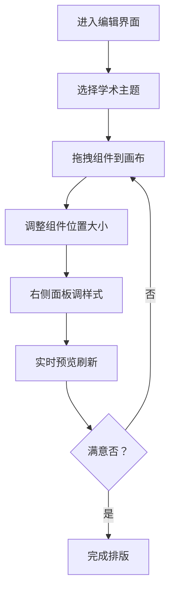

## 1. 产品概述

学术展板可视化编辑系统是一款面向科研人员的在线展板设计工具，支持拖拽式排版、科学风主题定制、实时预览等功能。

- 主要用途：帮助科研人员快速设计线下学术立式展板，无需专业设计技能
- 解决问题：传统展板设计门槛高、学术风格难以统一、排版调试效率低
- 目标用户：高校师生、科研机构研究人员、学术会议参会者
- 产品价值：提供专业学术主题模板，降低设计门槛，提升展板制作效率

## 2. 核心功能

### 2.1 用户角色

| 角色 | 注册方式 | 核心权限 |
|------|----------|----------|
| 普通用户 | 无需注册，直接使用 | 完整的展板编辑、预览功能 |

### 2.2 功能模块

1. **可视化编辑界面**：展板画布、组件库、属性面板、主题切换
2. **展板渲染服务**：独立渲染进程，8839端口提供画布渲染
3. **拖拽排版系统**：支持图表、文字、图片模块的自由拖拽定位
4. **主题样式系统**：物理/生物两套学术主题，配色字体一键切换
5. **实时预览系统**：布局修改实时刷新，3839端口提供编辑预览

### 2.3 页面详情

| 页面名称 | 模块名称 | 功能描述 |
|----------|----------|----------|
| 编辑主界面 | 顶部工具栏 | 主题切换、重置布局、画布缩放控制 |
| 编辑主界面 | 左侧组件库 | 实验数据图表、文字结论、实验组图片三类可拖拽组件 |
| 编辑主界面 | 中央画布区 | 900×1200mm立式展板尺寸，毫米级精度排版 |
| 编辑主界面 | 右侧属性面板 | 配色方案、字体样式、分区边框样式调整 |
| 编辑主界面 | 状态提示区 | 显示当前主题、组件数量、修改状态 |

## 3. 核心流程

用户进入编辑界面 → 选择学术主题（物理/生物）→ 从左侧组件库拖拽模块到画布 → 调整模块位置和大小 → 在右侧面板调整样式属性 → 实时预览效果 → 重复调整直至满意

## 4. 用户界面设计

### 4.1 设计风格

- **主色调**：学术蓝（#1E3A5F）作为基础色，辅以专业科研配色
- **主题配色**：
  - 物理主题：深蓝（#0F172A）+ 亮蓝（#3B82F6）+ 中性灰
  - 生物主题：墨绿（#14532D）+ 翠绿（#22C55E）+ 暖米白
- **按钮风格**：直角矩形，细微边框，hover时轻微阴影变化
- **字体**：
  - 标题：Noto Serif SC（宋体风格，学术感）
  - 正文：Noto Sans SC（清晰易读）
  - 数据：JetBrains Mono（等宽字体，适合数据展示）
- **布局风格**：三栏式布局（组件库-画布-属性面板），清晰的功能分区
- **图标风格**：线性简约图标，lucide-react图标库

### 4.2 页面设计概述

| 页面名称 | 模块名称 | UI元素 |
|----------|----------|---------|
| 编辑主界面 | 顶部工具栏 | 深色背景，主题切换下拉，操作按钮组，状态指示器 |
| 编辑主界面 | 左侧组件库 | 卡片式组件预览，拖拽手柄，悬停高亮效果 |
| 编辑主界面 | 中央画布区 | 带毫米刻度标尺，网格对齐辅助线，选中组件边框高亮 |
| 编辑主界面 | 右侧属性面板 | 分组折叠面板，颜色选择器，滑块控制器，样式预览 |
| 编辑主界面 | 画布组件 | 图表带坐标轴，文字带排版，图片带边框和说明 |

### 4.3 响应式

- 桌面端优先设计，最低支持1440×900分辨率
- 三栏布局固定宽度，中央画布区自适应缩放
- 不支持移动端，专注桌面端专业编辑体验

### 4.4 交互动效

- 拖拽时半透明预览效果
- 组件选中时蓝色边框高亮 + 调整手柄
- 主题切换时平滑过渡动画（300ms）
- 属性修改时画布实时刷新，无延迟感
- 组件吸附对齐时轻微磁吸反馈
