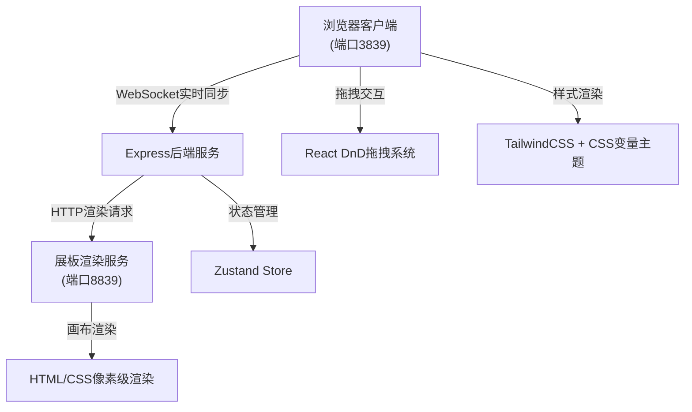
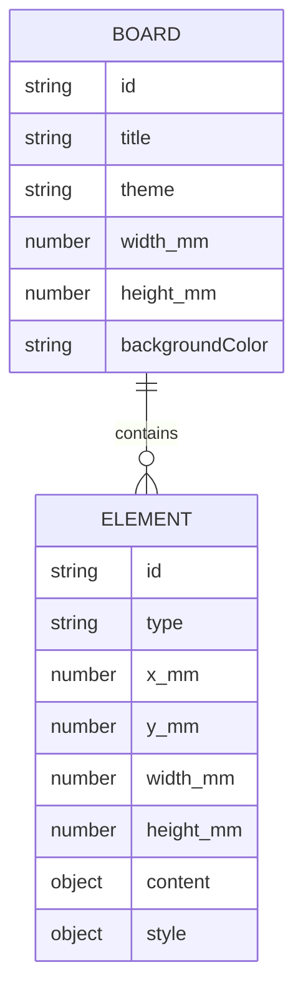

## 1. 架构设计



## 2. 技术描述

- **前端框架**：React@18 + TypeScript@5 + Vite@5
- **状态管理**：Zustand@4
- **样式方案**：TailwindCSS@3 + CSS变量主题系统
- **拖拽系统**：@dnd-kit/core + @dnd-kit/sortable
- **后端服务**：Express@4（双端口架构）
- **图标库**：lucide-react@0.344
- **实时通信**：WebSocket（ws@8）
- **初始化工具**：vite-init

### 双端口架构说明
- **3839端口**：Vite开发服务器，提供React编辑界面
- **8839端口**：Express渲染服务，提供独立的展板画布渲染

## 3. 目录结构

```
├── src/
│   ├── components/
│   │   ├── canvas/          # 画布相关组件
│   │   │   ├── BoardCanvas.tsx
│   │   │   ├── BoardElement.tsx
│   │   │   └── Ruler.tsx
│   │   ├── panels/          # 面板组件
│   │   │   ├── Toolbar.tsx
│   │   │   ├── ComponentLibrary.tsx
│   │   │   └── PropertyPanel.tsx
│   │   ├── elements/        # 展板元素组件
│   │   │   ├── ChartElement.tsx
│   │   │   ├── TextElement.tsx
│   │   │   └── ImageElement.tsx
│   │   └── theme/           # 主题相关
│   │       ├── ThemeSelector.tsx
│   │       └── themes.ts
│   ├── hooks/
│   │   ├── useDragDrop.ts
│   │   └── useBoardState.ts
│   ├── store/
│   │   └── useBoardStore.ts
│   ├── types/
│   │   └── index.ts
│   ├── utils/
│   │   └── unitConversion.ts
│   ├── pages/
│   │   └── Editor.tsx
│   ├── App.tsx
│   └── main.tsx
├── api/
│   ├── server.ts            # 3839端口主服务
│   └── renderServer.ts      # 8839端口渲染服务
├── shared/
│   └── types.ts
├── vite.config.ts
├── tailwind.config.js
└── package.json
```

## 4. 路由定义

| 路由 | 端口 | 用途 |
|------|------|------|
| / | 3839 | 编辑主界面 |
| /api/board | 3839 | 获取/保存展板布局数据 |
| /render | 8839 | 展板渲染页面（iframe嵌入） |
| /api/render | 8839 | 渲染服务API |
| /ws | 3839 | WebSocket实时同步连接 |

## 5. 数据模型

### 5.1 数据模型定义



### 5.2 TypeScript类型定义

```typescript
// shared/types.ts
export type ThemeType = 'physics' | 'biology';

export type ElementType = 'chart' | 'text' | 'image';

export interface BoardStyle {
  backgroundColor: string;
  borderColor: string;
  borderWidth: number;
  fontFamily: string;
  titleColor: string;
  textColor: string;
  accentColor: string;
}

export interface ChartContent {
  chartType: 'bar' | 'line' | 'scatter';
  title: string;
  xLabel: string;
  yLabel: string;
  data: Array<{ x: number; y: number; group?: string }>;
}

export interface TextContent {
  title: string;
  content: string;
  fontSize: number;
  fontWeight: 'normal' | 'bold';
}

export interface ImageContent {
  src: string;
  caption: string;
  scale: 'cover' | 'contain';
}

export interface BoardElement {
  id: string;
  type: ElementType;
  x: number;
  y: number;
  width: number;
  height: number;
  content: ChartContent | TextContent | ImageContent;
  style: {
    borderStyle: 'solid' | 'dashed' | 'none';
    borderColor: string;
    borderWidth: number;
    backgroundColor: string;
    padding: number;
  };
}

export interface BoardState {
  id: string;
  title: string;
  theme: ThemeType;
  width: number;
  height: number;
  elements: BoardElement[];
  selectedElementId: string | null;
  zoom: number;
  style: BoardStyle;
}
```

## 6. 主题系统

### CSS变量定义

```css
:root {
  /* 物理主题 */
  --physics-bg: #0F172A;
  --physics-surface: #1E293B;
  --physics-accent: #3B82F6;
  --physics-text: #F1F5F9;
  --physics-border: #475569;
  
  /* 生物主题 */
  --biology-bg: #F7F3E9;
  --biology-surface: #FEFDFB;
  --biology-accent: #22C55E;
  --biology-text: #14532D;
  --biology-border: #86EFAC;
}
```

## 7. 单位转换工具

```typescript
// 毫米转像素 (假设96 DPI，1英寸 = 25.4mm)
export const mmToPx = (mm: number, dpi: number = 96): number => {
  return (mm / 25.4) * dpi;
};

// 像素转毫米
export const pxToMm = (px: number, dpi: number = 96): number => {
  return (px * 25.4) / dpi;
};
```

## 8. API接口定义

```typescript
// GET /api/board
// Response: BoardState

// PUT /api/board
// Request: Partial<BoardState>
// Response: BoardState

// POST /api/element
// Request: BoardElement
// Response: BoardElement

// PUT /api/element/:id
// Request: Partial<BoardElement>
// Response: BoardElement

// DELETE /api/element/:id
// Response: { success: boolean }

// GET /render?boardId=xxx
// Response: HTML渲染页面
```
